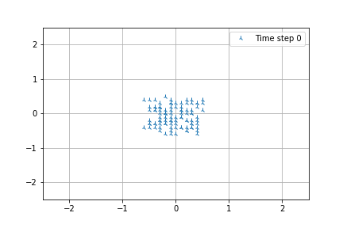
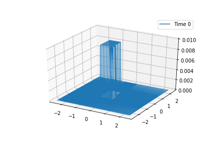

# Diffusion-Equation

 Diffusion Equation as shown in the course of Models of Theoretical Physics:

$$
\mathbf{\partial_t p(x, t) = D\partial^2_xp(x,t)}
$$

We set $x_i = l\cdot i$ with $i\in\mathbb{Z}$, we obtain an example of diffusion model on the left and the verification of the cental limit theorem on the right

Diffusion

Probability distribution

